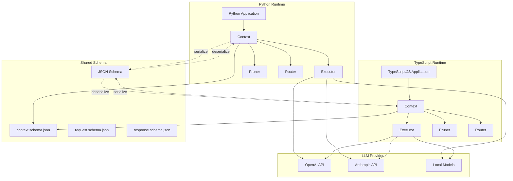
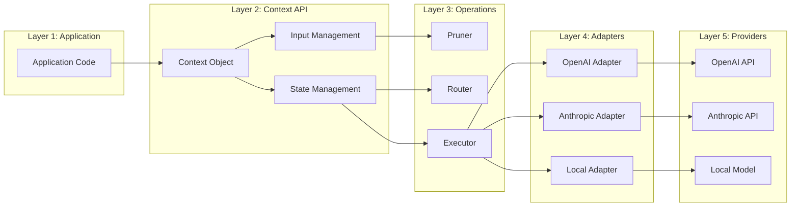
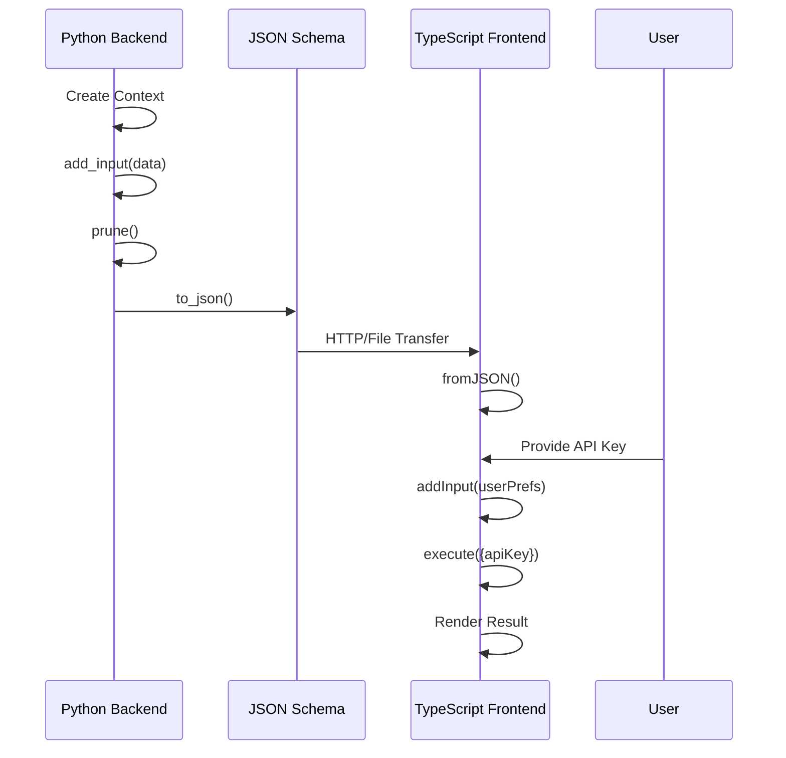
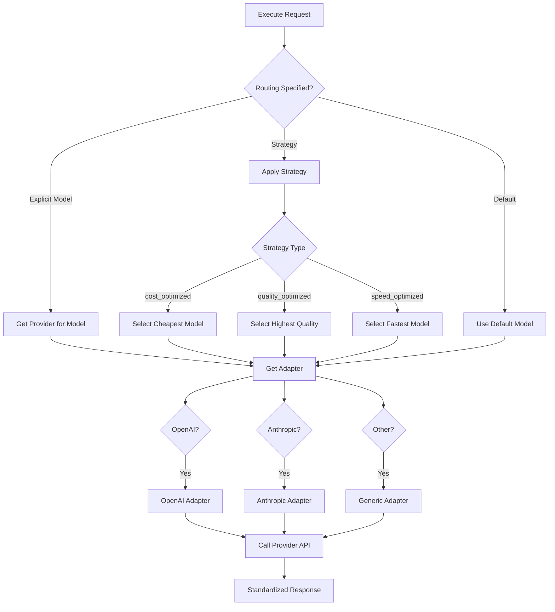
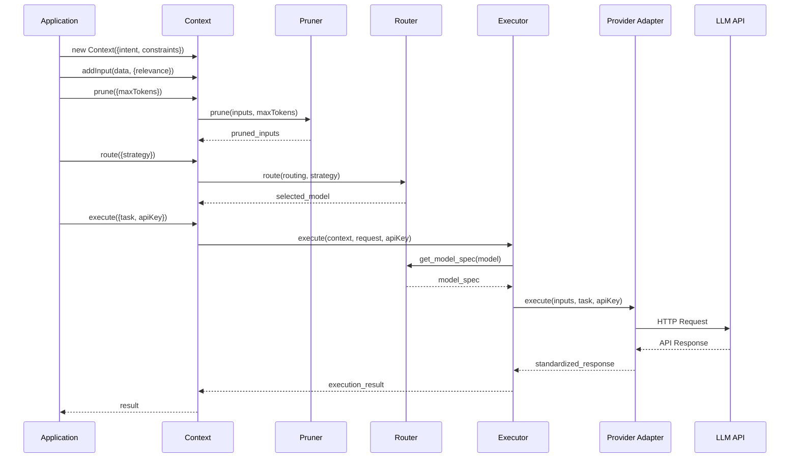

# Architecture

This document describes the cross-runtime architecture of Context, including serialization, the adapter model, and design patterns.

## Cross-Runtime Architecture

Context is designed to work identically across Python and TypeScript runtimes, enabling seamless workflows from backend to frontend.

### High-Level Architecture



### Component Layers



## Serialization Format

Context uses JSON serialization to enable cross-runtime state transfer. The serialization format is defined by JSON schemas in the `schema/` directory.

### Context Serialization Structure

```json
{
  "id": "uuid-string",
  "intent": "analyze",
  "category": "metadata_analysis",
  "inputs": [
    {
      "data": "any-json-serializable-value",
      "relevance": 0.9,
      "tokens": 42
    }
  ],
  "constraints": {
    "max_tokens": 4000,
    "max_time": 30,
    "max_cost": 0.10
  },
  "routing": {
    "model": "gpt-4",
    "provider": "openai",
    "strategy": "cost_optimized",
    "temperature": 0.7
  },
  "output": {
    "format": "json",
    "schema": {}
  },
  "metadata": {
    "created_by": "example-app",
    "version": "1.0"
  },
  "parent_id": "parent-uuid",
  "created_at": "2024-01-01T00:00:00Z"
}
```

### Schema Ownership

The `schema/` directory contains the source of truth for Context's data structures:

- **context.schema.json**: Defines the Context object structure
- **request.schema.json**: Defines execution request structure
- **response.schema.json**: Defines execution response structure

Both Python and TypeScript implementations conform to these schemas. Any changes to the data model must update the schemas first, then both language implementations.

### Cross-Runtime Serialization Flow



## Adapter Model

Context uses an adapter pattern to support multiple LLM providers while maintaining a consistent interface.

### Provider Adapters

Each provider adapter implements a common interface:

```python
class ProviderAdapter:
    def execute(self, context: Context, request: dict, api_key: str) -> dict:
        """Execute context with provider-specific API"""
        pass
```

### Adapter Selection



### Strategy Implementation

Strategies are implemented in the Router component:

```python
# core/python/context/router.py
class Router:
    MODEL_SPECS = {
        "gpt-4": {
            "provider": "openai",
            "max_tokens": 8192,
            "cost_per_1k_input": 0.03,
            "quality_score": 0.95,
            "speed_score": 0.6
        },
        "gpt-3.5-turbo": {
            "provider": "openai",
            "max_tokens": 4096,
            "cost_per_1k_input": 0.0015,
            "quality_score": 0.75,
            "speed_score": 0.9
        },
        # ... more models
    }
    
    def route(self, current_routing, model=None, provider=None, strategy=None):
        if strategy == "cost_optimized":
            return self._select_by_cost()
        elif strategy == "quality_optimized":
            return self._select_by_quality()
        elif strategy == "speed_optimized":
            return self._select_by_speed()
        # ...
```

The same logic exists in TypeScript: `core/typescript/src/router.ts`

## Execution Flow

### Standard Execution



### Stub Execution (Development/Testing)

When no API key is provided, Context uses stub execution:

```python
# core/python/context/executor.py
class Executor:
    def execute(self, context, request, api_key=None):
        if api_key is None:
            # Stub execution for testing
            return self._stub_execute(context, request)
        
        # Real execution with adapter
        adapter = self._get_adapter(context.routing)
        return adapter.execute(context, request, api_key)
    
    def _stub_execute(self, context, request):
        return {
            "result": f"[STUB] Would execute: {request['task']}",
            "context_id": context.id,
            "model_used": context.routing.get("model", "gpt-3.5-turbo"),
            "provider_used": context.routing.get("provider", "openai"),
            "duration": 0.1,
            "metadata": {
                "intent": context.intent,
                "input_count": len(context.inputs),
                "total_input_tokens": context.get_total_tokens()
            }
        }
```

## Repository Structure

```
context/
├── core/                      # Core implementations
│   ├── python/               # Python implementation
│   │   ├── context/
│   │   │   ├── __init__.py   # Package exports
│   │   │   ├── context.py    # Context class
│   │   │   ├── executor.py   # Execution engine
│   │   │   ├── pruner.py     # Input pruning logic
│   │   │   └── router.py     # Model routing logic
│   │   ├── tests/
│   │   └── pyproject.toml    # Python package config
│   │
│   └── typescript/           # TypeScript implementation
│       ├── src/
│       │   ├── context.ts    # Context class
│       │   ├── executor.ts   # Execution engine
│       │   ├── pruner.ts     # Input pruning logic
│       │   ├── router.ts     # Model routing logic
│       │   ├── uuid.ts       # UUID generation
│       │   └── index.ts      # Package exports
│       ├── dist/             # Compiled JS (gitignored)
│       ├── tests/
│       ├── package.json      # NPM package config
│       └── tsconfig.json     # TypeScript config
│
├── schema/                   # Shared JSON schemas
│   ├── context.schema.json   # Context structure
│   ├── request.schema.json   # Request structure
│   └── response.schema.json  # Response structure
│
├── docs/                     # Documentation
│   ├── index.md             # This file
│   ├── architecture.md      # Architecture (this doc)
│   ├── getting-started.md   # Tutorial
│   ├── reference.md         # API reference
│   ├── examples.md          # Usage examples
│   └── migration.md         # Migration guide
│
├── examples/                # Example implementations
│   ├── backend-automation/  # Backend examples
│   ├── browser-analysis/    # Frontend examples
│   └── hybrid-workflow/     # Cross-runtime examples
│
└── README.md               # Project overview
```

## Design Patterns

### 1. Immutable-by-Convention

While Context objects are technically mutable, operations follow an immutable pattern:

```python
# Methods return self for chaining
ctx.add_input(data).prune().route(strategy="cost").execute(task)

# Extension creates new instance
child = parent.extend(intent="summarize")  # parent unchanged
```

### 2. Builder Pattern

Context construction uses the builder pattern:

```python
ctx = (Context(intent="analyze")
       .add_input(data1, relevance=0.9)
       .add_input(data2, relevance=0.7)
       .prune(max_tokens=2000)
       .route(strategy="cost_optimized"))
```

### 3. Strategy Pattern

Routing uses strategy pattern for model selection:

```python
# Different strategies select different models
ctx.route(strategy="cost_optimized")     # Cheapest
ctx.route(strategy="quality_optimized")  # Best quality
ctx.route(strategy="speed_optimized")    # Fastest
```

### 4. Adapter Pattern

Provider adapters isolate API-specific logic:

```python
# Executor selects appropriate adapter
adapter = AdapterFactory.get_adapter(provider)
result = adapter.execute(context, request, api_key)
```

## Language Parity

Both Python and TypeScript implementations provide identical functionality:

| Feature | Python | TypeScript | Notes |
|---------|--------|------------|-------|
| Context creation | ✓ | ✓ | Identical API |
| Input management | ✓ | ✓ | add_input / addInput |
| Pruning | ✓ | ✓ | Same algorithm |
| Routing | ✓ | ✓ | Same strategies |
| Execution | ✓ | ✓ | Same interface |
| Serialization | ✓ | ✓ | Same JSON format |
| Extension | ✓ | ✓ | Same inheritance |
| Merging | ✓ | ✓ | Same merge logic |

### Naming Conventions

Python uses snake_case, TypeScript uses camelCase:

```python
# Python
ctx.add_input(data)
ctx.get_total_tokens()
ctx.to_json()
Context.from_json(json_str)
```

```typescript
// TypeScript
ctx.addInput(data);
ctx.getTotalTokens();
ctx.toJSON();
Context.fromJSON(jsonData);
```

## Extensibility

### Adding a New Provider

1. Define model specs in `router.py` and `router.ts`
2. Create adapter in `adapters/{provider}/` (future)
3. Register adapter in Executor
4. Document in API reference

### Adding a New Strategy

1. Add strategy to `Router.route()` in both languages
2. Implement selection logic
3. Update documentation
4. Add tests

### Custom Pruning Logic

Currently, pruning uses relevance-based selection. Future extensions could:

- Support custom pruning functions
- Use semantic similarity for selection
- Implement dynamic token estimation
- Add cost-aware pruning

## Performance Considerations

### Token Estimation

Token estimation uses a simple heuristic (4 chars ≈ 1 token). For more accurate estimation:

```python
# Install tiktoken for accurate counting
import tiktoken
encoder = tiktoken.encoding_for_model("gpt-4")
tokens = len(encoder.encode(text))
ctx.add_input(text, tokens=tokens)
```

### Serialization Size

Large contexts can produce large JSON. Optimize by:

1. Pruning before serialization
2. Removing unnecessary metadata
3. Compressing JSON for transmission

### Execution Caching

Applications can cache execution results:

```python
cache_key = f"{ctx.id}:{request_hash}"
if cache_key in cache:
    return cache[cache_key]
result = ctx.execute(task)
cache[cache_key] = result
```

## Security Considerations

### API Key Handling

Context **never** stores API keys. Keys are passed per-execution:

```python
# ✓ GOOD: Key passed at execution time
result = ctx.execute(task, api_key=get_key_from_env())

# ✗ BAD: Don't store key in context
ctx.api_key = key  # This field doesn't exist
```

### Input Validation

Context performs minimal validation. Applications should:

1. Validate inputs before adding to context
2. Sanitize user-provided data
3. Implement rate limiting
4. Monitor token usage and costs

### Serialization Safety

When deserializing contexts:

```python
# Validate source before deserializing
if not is_trusted_source(json_str):
    raise SecurityError("Untrusted context source")

ctx = Context.from_json(json_str)

# Verify constraints before execution
if ctx.constraints.get("max_cost", 0) > MAX_ALLOWED_COST:
    raise SecurityError("Cost limit exceeded")
```

## Future Architecture Directions

1. **Plugin System**: Support for custom pruners, routers, and executors
2. **Streaming**: Support for streaming execution results
3. **Batch Execution**: Execute multiple contexts in parallel
4. **Provider Discovery**: Automatic provider detection and configuration
5. **Schema Validation**: Runtime validation against JSON schemas
6. **Telemetry**: Built-in metrics and tracing hooks

## Related Documentation

- [Getting Started](getting-started.md) - Quick start guide
- [API Reference](reference.md) - Complete API documentation
- [Examples](examples.md) - Practical usage examples
- [Migration Guide](migration.md) - Migrating to Context
